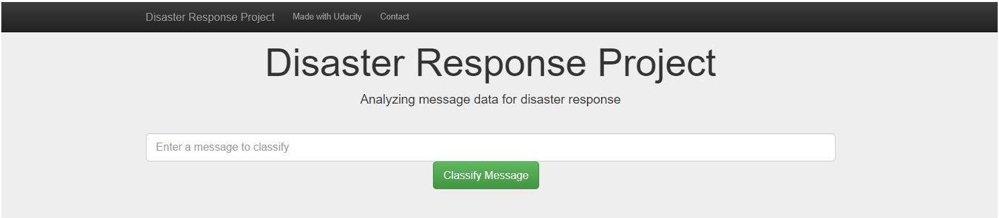
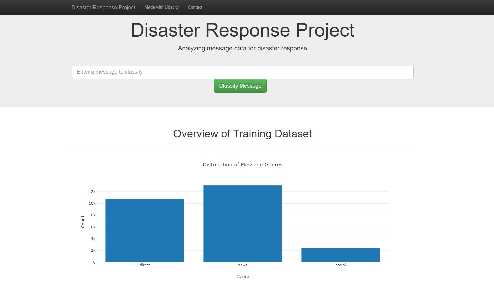
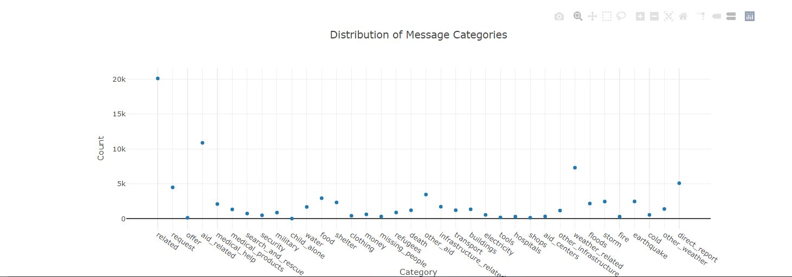
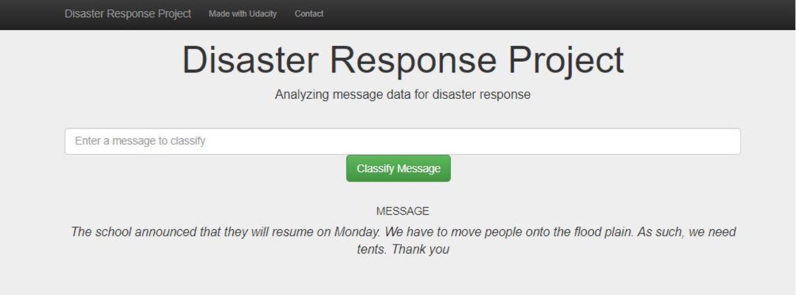
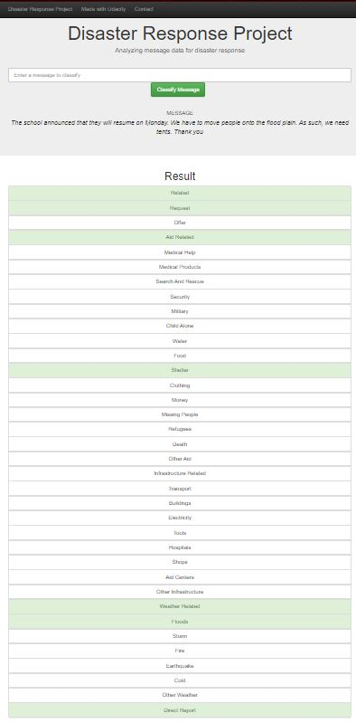
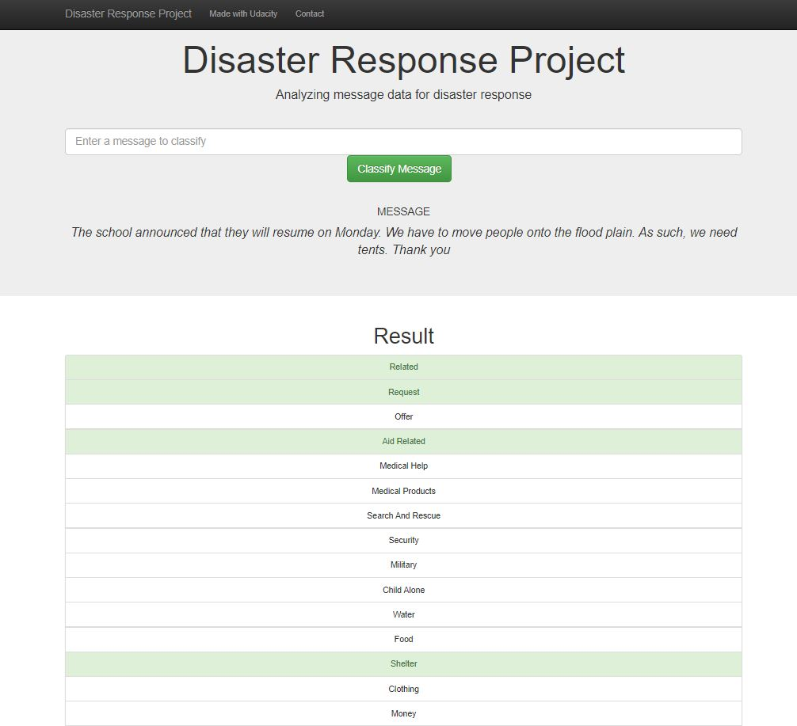

## Table of Contents

1. [Description](#description)
2. [Dependencies](#dependencies)
3. [Installing](#installing)
4. [Executing Program](#executing)
5. [Screenshots](#screenshots)

# Disaster Response Pipeline Project




<a name="descripton"></a>

## Description

This Project is part of the Data Scientist Nanodegree Program by Udacity.
The initial dataset contains pre-labelled tweet and messages from real-life disaster. 
The aim of the project is to build a Natural Language Processing tool that categorize messages.

<a name="getting_started"></a>
## Getting Started

<a name="dependencies"></a>
### Dependencies
- Python 3.7

- Libraries used:

1. SQLalchemy
2. NumPy
3. SciPy
4. Pandas
5. Sciki-Learn
6. NLTK
7. Flask, Plotly

<a name="installing"></a>
### Installing
Clone this GIT repository:
```
git clone https://github.com/mohdaj/Disaster-Response-Pipeline.git
```
<a name="executing"></a>
### Executing Program:
1. Run the following commands in the project's root directory to set up your database and model.

    - To run ETL pipeline that cleans data and stores in database
        `python data/process_data.py data/disaster_messages.csv data/disaster_categories.csv data/DisasterResponse.db`
    - To run ML pipeline that trains classifier and saves
        `python models/train_classifier.py data/DisasterResponse.db models/classifier.pkl`

2. Run the following command in the app's directory to run your web app.
    `python run.py`

3. Go to http://0.0.0.0:3001/

<a name="screenshots"></a>
## Screenshots

1. **The main page shows some graphs about training dataset, provided by Figure Eight**

   

   

2. **This is an example of a message you can type to test Machine Learning model performance**



2. **After clicking `Classify Message`, you can see the categories which the message belongs to highlighted in green***





